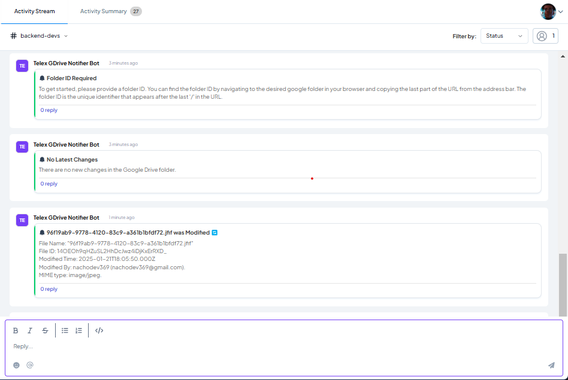
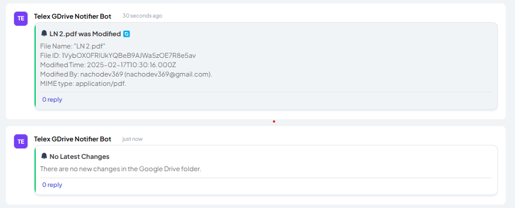

# 📢 Telex Google Drive Notifier

## 🚀 Description

Telex Google Drive Notifier is a **TypeScript Node.js application** that monitors changes in a specified Google Drive folder and sends real-time notifications to the Telex App via webhooks. It detects file uploads, modifications, and deletions in real-time, ensuring that users stay updated with any changes in their Google Drive folders.

## 📌 Features

✅ **Real-time monitoring** of Google Drive folder changes  
✅ **Instant notifications** to Telex App via webhooks  
✅ **TypeScript** for enhanced type safety and developer experience  
✅ **Google Drive API v3** integration for reliable change detection  
✅ **Redis** for configuration persistence and caching  
✅ **Express.js** server with comprehensive error handling  
✅ **Jest** testing framework with TypeScript support  
✅ **ESLint & Prettier** for code quality and formatting  
✅ **Systemd service** support for VPS deployment  
✅ **CI/CD pipeline** with GitHub Actions

## 🛠 Tech Stack

- **Runtime**: Node.js v18+
- **Language**: TypeScript 5.3+
- **Framework**: Express.js 4.21+
- **Database**: Redis 4.7+
- **API**: Google Drive API v3
- **Testing**: Jest 29+ with ts-jest
- **Build Tool**: TypeScript Compiler (tsc)
- **Code Quality**: ESLint 9+ & Prettier 3+

## 📦 Installation

### 1️⃣ Clone the Repository

```bash
git clone https://github.com/na-cho-dev/telex-gdrive-notifier.git
cd telex-gdrive-notifier
```

### 2️⃣ Install Dependencies

```bash
npm install
```

### 3️⃣ Set Up Environment Variables

Create a `.env` file in the project root:

```env
PORT=3300
GOOGLE_SERVICE_ACCOUNT_PATH=./config/service-account.json
GOOGLE_DRIVE_WEBHOOK_TOKEN='your-webhook-token-here'
TELEX_ENV='dev'
REDIS_HOST=127.0.0.1
REDIS_PORT=6379
DEV_WEBHOOK_URL='https://your-dev-webhook-url.com'
```

### 4️⃣ Google Service Account Setup

1. Get your Google Service Account JSON file by following [this guide](https://docs.edna.io/kb/get-service-json/)
2. Save the file as `service-account.json` in the `./config/` directory
3. Ensure the service account has Google Drive API access

### 5️⃣ Start Redis Server

```bash
# On Ubuntu/Debian
sudo systemctl start redis-server

# Or run directly
redis-server
```

### 6️⃣ Build and Start the Application

```bash
# Build TypeScript to JavaScript
npm run build

# Start the application
npm start
```

**For development:**

```bash
# Run with hot-reload using tsx
npm run dev
```

## 🧪 Testing

### Prerequisites
Ensure Redis is running:
```bash
redis-server
```

### Run Tests
```bash
# Run all tests
npm test

# Run tests in watch mode
npm run test:watch

# Generate coverage report
npm run test:coverage
```

## 🔗 API Endpoints

### 🔹 Integration JSON
**GET /integration.json**  
Returns the Telex integration configuration

### 🔹 Telex Webhook
**POST /tick**  
Registers webhook and starts monitoring Google Drive folder

**Request Body:**
```json
{
  "channel_id": "your-channel-id",
  "return_url": "https://your-telex-webhook-url.com",
  "settings": [
    {
      "label": "Folder ID",
      "type": "text",
      "required": true,
      "default": "your-google-drive-folder-id"
    }
  ]
}
```

### 🔹 Google Drive Webhook
**POST /gdrive-webhook**  
Receives notifications from Google Drive API when folder changes occur

### 🔹 Health Check
**GET /**  
Returns server status and welcome message

## 🏗 Build & Development

```bash
# Clean build
npm run prebuild  # Removes dist folder
npm run build     # Compiles TypeScript

# Code quality
npm run lint      # Run ESLint
npm run lint:fix  # Fix ESLint issues
npm run format    # Format code with Prettier

# Development
npm run dev       # Start with hot-reload
```

## 🚀 Deployment

### Option 1: Manual Deployment

1. **Build the application:**
```bash
npm run build
```

2. **Start with PM2 (recommended):**
```bash
npm install -g pm2
pm2 start dist/server.js --name telex-gdrive-notifier
pm2 save
pm2 startup
```

### Option 2: Systemd Service

1. **Create service file:**
```bash
sudo nano /etc/systemd/system/telex-gdrive-notifier.service
```

2. **Add configuration:**
```ini
[Unit]
Description=Telex GDrive Notifier
After=network.target redis.service

[Service]
Type=simple
User=root
WorkingDirectory=/root/telex-gdrive-notifier
ExecStart=/usr/bin/node dist/server.js
Restart=always
RestartSec=10
Environment=NODE_ENV=production
StandardOutput=journal
StandardError=journal

[Install]
WantedBy=multi-user.target
```

3. **Enable and start:**
```bash
sudo systemctl daemon-reload
sudo systemctl enable telex-gdrive-notifier
sudo systemctl start telex-gdrive-notifier
```

4. **Check status:**
```bash
sudo systemctl status telex-gdrive-notifier
journalctl -u telex-gdrive-notifier -f
```

### Option 3: Automatic Deployment with GitHub Actions

The repository includes a CI/CD pipeline that automatically deploys to DigitalOcean when you push to the `main` branch. Configure these secrets in your GitHub repository:

- `DO_SSH_PRIVATE_KEY`: Your DigitalOcean server SSH private key
- `DO_SSH_USER`: SSH username (usually `root`)  
- `DO_SERVER_IP`: Your server's IP address

## 📁 Project Structure

```
telex-gdrive-notifier/
├── src/
│   ├── controllers/          # Request handlers
│   │   ├── gdriveWebhookController.ts
│   │   ├── jsonIntegrationController.ts
│   │   └── telexWebhookController.ts
│   ├── database/             # Database connections
│   │   ├── redisClient.ts
│   │   └── redisSubscriber.ts
│   ├── routers/              # Route definitions
│   │   ├── jsonIntegrationRouter.ts
│   │   └── webhookRouter.ts
│   ├── service/              # Business logic
│   │   ├── checkIfNoChanges.ts
│   │   ├── dataStore.ts
│   │   ├── googleDriveService.ts
│   │   ├── sendNotification.ts
│   │   └── startDriveWatch.ts
│   ├── types/                # TypeScript type definitions
│   │   └── index.ts
│   └── server.ts             # Application entry point
├── __tests__/                # Test files
├── dist/                     # Compiled JavaScript (generated)
├── config/                   # Configuration files
├── docs/                     # Documentation and screenshots
├── .github/workflows/        # GitHub Actions CI/CD
├── eslint.config.ts          # ESLint configuration
├── jest.config.ts            # Jest testing configuration
├── babel.config.ts           # Babel configuration
├── tsconfig.json             # TypeScript configuration
└── package.json              # Dependencies and scripts
```

## ⚙️ Telex Integration Setup

1. **Add Integration URL** in your Telex organization:
   ```
   https://your-domain.com/integration.json
   ```

2. **Configure Settings:**
   - **Folder ID**: The Google Drive folder ID you want to monitor
   - **Interval**: Set to `* * * * *` (every minute) for real-time monitoring

3. **Get Google Drive Folder ID:**
   - Open Google Drive and navigate to your target folder
   - Copy the folder ID from the URL:
   ```
   https://drive.google.com/drive/folders/1AbCdEfGhIjKlMnOpQrStUvWxYz
   ```
   - The folder ID is: `1AbCdEfGhIjKlMnOpQrStUvWxYz`

## 🚦 Monitoring & Logging

### Request Logging
All requests are automatically logged in the format:
```
[2025-02-23T12:34:56.789Z] - [GET /integration.json HTTP/1.1] - 200 OK (25ms)
```

### Redis Monitoring
```bash
# Check Redis status
redis-cli ping

# Monitor Redis commands
redis-cli monitor

# Clear all data (if needed)
redis-cli FLUSHALL
```

### Application Logs
```bash
# With systemd
journalctl -u telex-gdrive-notifier -f

# With PM2
pm2 logs telex-gdrive-notifier
```

## 🛑 Troubleshooting

### Common Issues

1. **"Cannot read properties of undefined (reading 'Router')"**
   - Ensure all dependencies are installed: `npm install`
   - Rebuild the project: `npm run build`

2. **Redis connection errors**
   - Check if Redis is running: `systemctl status redis-server`
   - Verify Redis configuration in `.env`

3. **Google Drive API errors**
   - Verify service account JSON file exists in `./config/`
   - Ensure service account has Drive API permissions
   - Check Google Drive API quotas

4. **TypeScript compilation errors**
   - Run: `npx tsc --noEmit` to check for type errors
   - Ensure all TypeScript dependencies are installed

## 📷 Screenshots



## 🌐 Live Demo

The application is deployed at: **[https://telexgdrivenotifier.live](https://telexgdrivenotifier.live)**

## 📜 License

This project is licensed under the **MIT License** - see the [LICENSE](LICENSE) file for details.

## 📬 Contact & Support

- **Developer**: Fortune Iheanacho
- **Email**: nachodev369@gmail.com
- **GitHub**: [@na-cho-dev](https://github.com/na-cho-dev)

## 🤝 Contributing

1. Fork the repository
2. Create your feature branch: `git checkout -b feature/amazing-feature`
3. Commit your changes: `git commit -m 'Add amazing feature'`
4. Push to the branch: `git push origin feature/amazing-feature`
5. Open a Pull Request

## ⭐ Show Your Support

If this project helped you, please consider giving it a ⭐ on GitHub!